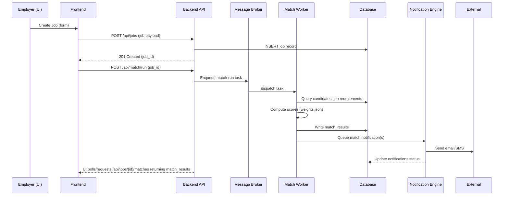

# High Level Design — Flexibees Employer Product

Version: 1.0  
Generated: 2025-11-23 13:13:27 UTC

Contents
- 1. Executive summary
- 2. System context & goals
- 3. Logical architecture & components
- 4. Data flow and integration diagrams
- 5. Design decisions & trade-offs
- 6. Non-functional requirements and how they are met
- 7. Scalability & capacity planning
- 8. Security, privacy & compliance at high level
- 9. Operational considerations (observability, backup, DR)
- 10. Roadmap / next deliverables
- Appendix: key artifacts & mappings to code

---

## 1. Executive summary

Flexibees is an employer-facing job-posting and candidate-matching platform. The current implementation is split across:
- Frontend: Next.js (appinessgit/flexibees-employer),
- Backend(s): Python (appinessgit/flexibees-bed and appinessgit/fb_employer_portal) — providing core API, matching/scoring, notification orchestration, background jobs,
- Config & artifacts: JSON-based questionnaires and weights (weights.json, employer_question.json, flexifit_questions.json), skills.csv, country_cities.json.

This High Level Design (HLD) documents the system architecture, data flow, major design decisions, non-functional requirements (NFRs), scalability, security principles, and operational practices inferred from the codebase. It is intended to guide implementation hardening, deployment, and further engineering.

---

## 2. System context & goals

Primary goals
- Provide a responsive employer UI to create/manage jobs and review ranked candidate matches.
- Automate candidate scoring/matching based on structured resumes, questionnaire answers and configurable weights.
- Deliver reliable notifications for new matches and workflow events (email/SMS/push).
- Support background processing for scheduled re-scoring and large computations.
- Meet expectations for availability, latency, and data privacy.

Stakeholders
- Employers / Recruiters (users)
- Candidates (data subjects)
- Platform Operators / DevOps
- Integrations (Email/SMS providers, S3/Object storage)

Key constraints (from repo artifacts)
- Matching logic driven by JSON weights and question sets (weights.json, employer_question.json, flexifit_questions.json).
- Background/cron-driven workloads exist (crons/, commands/).
- Containerization and Jenkins-based CI are present.

---

## 3. Logical architecture & components

High-level component diagram (Mermaid)

```mermaid
graph TD
  U[Employer / Recruiter] -->|Browser| FE[Next.js Frontend\n(flexibees-employer)]
  FE -->|HTTPS / REST| API[Backend API\n(flexibees-bed / fb_employer_portal)]
  API --> DB[(Relational DB)\n(Postgres)]
  API --> Cache[(Redis / Cache)]
  API --> Storage[(Object Store)\n(S3)]
  API --> MQ[(Message Broker)\n(Redis/RabbitMQ)]
  MQ --> Worker[Workers: match-worker,\nnotification-worker, maintenance-worker]
  Worker --> API
  Worker --> NotificationSvc[External Notification APIs\n(SMTP / SMS gateway)]
  Monitoring[(Monitoring & Tracing)] --> API
  Monitoring --> Worker
  CDN[CDN] --> FE
  FE --> CDN
  Nginx[Ingress / Reverse Proxy] --> API
  subgraph Infra
    DB
    Cache
    Storage
    MQ
    Nginx
    CDN
  end
```

Components explained
- Frontend (Next.js)
  - UI routes for job creation, match view, dashboards.
  - Authentication and session handling (likely via JWT or HTTP-only cookie).
- API Layer (Django-like Python apps)
  - Job, candidate, application CRUD.
  - Exposes match listing endpoints and endpoints for enqueuing matching tasks.
  - Hosts notification orchestration or forwards to notification-engine.
- Matching Service / Workers
  - Stateless match-workers load job and candidate data, apply scoring weights (weights.json) and produce match_results persisted to DB.
  - Runs as background worker(s), can be triggered by UI (async) or scheduled cron/beat.
- Notification Engine
  - Queues notifications, applies templates, sends via external providers with retries.
- Persistence & Infra
  - Postgres for relational data, Redis for cache and broker, S3 for resumes & large artifacts, message broker for tasks.
- Observability
  - Centralized logging, metrics (Prometheus), and tracing (OpenTelemetry/Jaeger).

Component responsibilities mapped to repos
- flexibees-employer: UI, environment configs for connecting to API.
- flexibees-bed: core API, matching logic, Docker artifacts, crons.
- fb_employer_portal: employer-specific APIs, notification_engine, templates, orchestration.

---

## 4. Data flow and integration diagrams

4.1 User -> Create Job -> Match flow (sequence)



4.2 Data flow for candidate application & resume processing

- Candidate uploads resume (or resume is imported):
  - Resume stored in S3; resume_url saved in candidates.profile_data.
  - Background resume-parsing worker extracts skills, experience, stores parsed JSON in profile_data.
  - Candidate skills normalized against master skills.csv.
  - When resume parsed, worker enqueues match re-run for relevant jobs.

4.3 Integration points
- External Notification Providers: SMTP, Twilio-like SMS, Push gateways.
- Object Storage (S3 or compatible): resume and large attachments.
- Third-party auth or social login (implied by FB name in fb_employer_portal) — OAuth integration for social onboarding.

---

## 5. Design decisions & trade-offs

Decision: JSONB for flexible entities
- Rationale: Employer questions, answers, and scoring weights are naturally JSON. JSONB allows schema flexibility and faster iteration without DB migrations.
- Trade-off: Harder to query complex attributes; mitigate by storing frequently queried fields as columns and adding GIN indexes.

Decision: Background workers vs. synchronous scoring
- Rationale: Scoring can be compute-heavy; running asynchronously avoids blocking API response and allows retries/backoff.
- Trade-off: Slight eventual consistency in match availability; mitigated by immediate task enqueue + optimistic UI message ("matches being computed") and polling/webhook.

Decision: Containerization + Compose for local, Kubernetes for prod
- Rationale: Docker-compose simplifies local dev; Kubernetes offers production-grade scaling and resilience.
- Trade-off: Higher operational complexity for Kubernetes; mitigated by templated manifests and CI/CD.

Decision: Separate notification engine
- Rationale: Isolates external dependencies, can scale independently and follow different retry policies.
- Trade-off: Additional moving part; mitigated by simple MQ contract and clear task payload schema.

---

## 6. Non-functional requirements (NFRs) and how they are addressed

Availability
- Target: 99.9% for API endpoints (stateless web app), higher resiliency for workers via auto-restart and multiple replicas.
- Implementation:
  - Deploy multiple web replicas behind load balancer/Ingress.
  - Use managed DB with failover where possible.
  - Health checks & readiness/liveness probes in K8s.

Performance / Latency
- Target: API p95 < 300ms for read endpoints; match computation is asynchronous.
- Implementation:
  - Cache commonly read objects in Redis (e.g., job metadata, frequently accessed candidate profiles).
  - CDN for static frontend assets.
  - DB indexes and JSONB GIN indices for heavy queries.

Scalability
- Horizontal scaling for web and worker pods; autoscaling based on CPU and queue backlog.
- Match-workers scale based on task queue length.

Consistency
- Eventual consistency for match_results (async). Ensure idempotent re-run logic and task deduplication.

Durability & Backup
- Daily DB backups (retention policy).
- S3 versioning for resumes.
- Store weights.json and other config in versioned storage (git + release tags).

Security
- TLS everywhere, secrets manager, RBAC for API operations (employer vs admin), PII masking (mask_data.json).
- Rate limiting and input validation.

Maintainability
- Separate services and clear module boundaries make testing and replacement feasible.
- Use structured logging and tracing for debugging.

---

## 7. Scalability & capacity planning

7.1 Workload characteristics
- Read-heavy UI endpoints (fetch jobs, matches).
- Write bursts for job creation and candidate applications.
- Compute-heavy background matching runs (CPU-bound depending on scoring algorithm complexity).

7.2 Sizing guidelines (example)
- Baseline: 100 employers, 10k candidates, 500 active jobs
  - Web: 2 replicas (small), HPA to 6 based on CPU/requests.
  - DB: single primary with read-replicas (1-2) depending on read load.
  - Redis: single instance scaled to cluster for production.
  - Workers: 2 match-worker instances; scale horizontally for nightly batch.

7.3 Autoscaling triggers
- Web HPA:
  - CPU > 60% sustained or request latency > threshold.
- Worker HPA:
  - Queue length (pending tasks) > X -> scale up by factor.
- DB:
  - Scale vertically or add read replicas depending on p95 read latency.

7.4 Optimization strategies
- Cache match_results for last N minutes to avoid re-computation on high read requests.
- Precompute matches for high-priority jobs (e.g., promoted jobs).
- Use batched database reads in workers to reduce DB roundtrips.

---

## 8. Security, privacy & compliance (high level)

Authentication & Authorization
- Use OAuth/JWT with short-lived tokens and refresh tokens OR HTTP-only cookies for SSR.
- Role-based access control: employers limited to own jobs and related data.

Data protection
- PII masked in logs; encrypt sensitive DB fields if needed.
- TLS in transit, encryption at rest in DB and object storage.

Secrets & Credentials
- Use secret manager (AWS Secrets Manager, HashiCorp Vault) for SMTP, SMS, DB credentials.

Audit & Compliance
- Audit logs for job changes, match re-computations, notification sends.
- Data export and deletion support for GDPR/PDPA compliance.

Third-party risks
- Limit privileges of external API keys.
- Implement retries with exponential backoff and circuit breakers for unstable providers.

---

## 9. Operational considerations (observability, backup, DR)

Observability
- Logs: JSON-structured logs shipped to ELK/Cloud logging.
- Metrics: Prometheus metrics for request counts, latencies, queue sizes, worker success/failure rates.
- Tracing: OpenTelemetry traces for request -> worker -> external call flows.
- Dashboards: Grafana for SLOs, queue health, notification success rates.

Alerts
- High error rate, slow request p95, task queue backlog thresholds.
- Notification provider failure spikes.

Backup & DR
- Postgres: point-in-time recovery (PITR) daily full backups, 30-day retention.
- S3: versioning and lifecycle rules.
- Disaster recovery: documented failover playbook, standby region replication for DB and S3 where required.

Incident response
- Playbooks for:
  - DB outages: failover to read-replica promotion or point to standby DB.
  - Worker backlog: scale workers, run manual batch split.
  - Notification provider outage: pause non-critical notifications, retry with backoff, alert.

Maintenance
- Rolling deploys with health checks.
- Preflight smoke tests on staging, manual gate to production.

---

## 10. Roadmap / next deliverables

Immediate next steps (deliverables I can produce)
- Convert inferred HLD into deployment-ready Kubernetes manifests and Helm charts.
- Generate code-accurate HLD & design artifacts by scanning models.py, views, and endpoint definitions (produce API spec OpenAPI).
- Produce runbooks for DB migrations and incident response matched to code.

Longer-term
- Formal SLOs and performance benchmarks (load-test plan).
- CI/CD job for automatic documentation generation (OpenAPI from code).
- Version-controlled weights management and A/B testing framework for matching weights.

---

## Appendix: key artifacts & mappings to code

- weights.json — scoring configuration (both Python repos)
- employer_question.json, flexifit_questions.json — question sets (matching logic)
- mask_data.json — PII masking rules
- Dockerfile, docker-compose.yml — containerization (flexibees-bed)
- Jenkinsfile — CI pipeline hints
- .env.* — environment sample (frontend); move to secrets manager for prod
- Next steps for fidelity: run a semantic scan of the Python repositories to extract accurate endpoints and model schemas and produce an OpenAPI spec.

---

