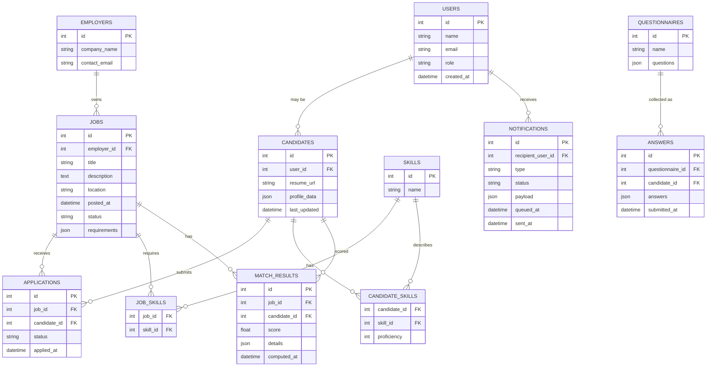

# Low Level Design — Flexibees Employer Product

Version: 1.0  
Generated: 2025-11-23 12:55:04 UTC

Contents
- 1. Overview
- 2. Key components and responsibilities (by repository)
- 3. Data model and DB schema (ER + tables)
- 4. Application data models (objects/entities)
- 5. APIs and Interfaces (HTTP endpoints & payloads)
- 6. Error handling & monitoring framework
- 7. Background jobs, crons, and worker interfaces
- 8. Deployment plan and operational runbook
- 9. Security, privacy & compliance considerations
- 10. Appendix: artifacts / supporting files from code base

---

## 1. Overview

This document defines the low-level design for the Flexibees Employer system derived from these repositories:
- appinessgit/flexibees-employer — Next.js frontend (JavaScript)
- appinessgit/flexibees-bed — Core backend & matching (Python)
- appinessgit/fb_employer_portal — Employer portal, notification engine (Python)

Primary concerns covered:
- Relational schema and key tables
- JSON-based models and config files (weights.json, employer_question.json, flexifit_questions.json)
- REST API endpoints consumed by the frontend
- Background workers and cron jobs
- Error handling and operational considerations
- Deployment (containers, reverse proxy, CI/CD hints from Jenkinsfile and docker-compose)

Assumptions (inferred from code structure):
- Backend(s) are Django-like Python apps (manage.py present)
- Matching/scoring uses weights.json and question sets
- Background processing is implemented as crons/management commands or Celery-like workers
- Persistent storage: relational DB (Postgres/MySQL), Redis for cache/broker, object storage for resume files (S3)

---

## 2. Key components and responsibilities

Table: Component | Repo | Primary responsibilities
| Component | Repository | Responsibilities |
|---|---:|---|
| Employer UI (Next.js) | flexibees-employer | Employer experience, job creation, viewing matches, dashboards, calls backend APIs. |
| Core API + Matching | flexibees-bed | REST APIs for job/candidate CRUD, matching/scoring engine, scheduled matching, Docker/docker-compose. |
| Employer Portal / Notifications | fb_employer_portal | Employer-specific flows, notification_engine, integration with external channels, templates, cron orchestration. |
| Static/Config Assets | both Python repos | weights.json, employer_question.json, flexifit_questions.json, skills.csv, country_cities.json — drive scoring and questionnaires. |
| CI/CD | both Python repos | Jenkinsfile indicates a Jenkins pipeline for builds and tests. |

---

## 3. Data model and DB schema

High-level ER diagram (Mermaid)

Relational table definitions (simplified DDL-like):

- users
  - id SERIAL PRIMARY KEY
  - name VARCHAR(255)
  - email VARCHAR(255) UNIQUE
  - role VARCHAR(50) -- e.g., employer/admin/candidate
  - created_at TIMESTAMP DEFAULT now()

- employers
  - id SERIAL PRIMARY KEY
  - company_name VARCHAR(255)
  - contact_email VARCHAR(255)
  - created_at TIMESTAMP

- jobs
  - id SERIAL PRIMARY KEY
  - employer_id INTEGER REFERENCES employers(id)
  - title VARCHAR(255)
  - description TEXT
  - location VARCHAR(255)
  - posted_at TIMESTAMP
  - status VARCHAR(50) -- draft, published, closed
  - requirements JSONB

- candidates
  - id SERIAL PRIMARY KEY
  - user_id INTEGER REFERENCES users(id)
  - resume_url TEXT
  - profile_data JSONB
  - last_updated TIMESTAMP

- applications
  - id SERIAL PRIMARY KEY
  - job_id INTEGER REFERENCES jobs(id)
  - candidate_id INTEGER REFERENCES candidates(id)
  - status VARCHAR(50) -- applied, shortlisted, rejected
  - applied_at TIMESTAMP

- skills
  - id SERIAL PRIMARY KEY
  - name VARCHAR(200)

- job_skills
  - job_id INT REFERENCES jobs(id)
  - skill_id INT REFERENCES skills(id)
  - (composite PK job_id, skill_id)

- candidate_skills
  - candidate_id INT REFERENCES candidates(id)
  - skill_id INT REFERENCES skills(id)
  - proficiency INT

- questionnaires
  - id SERIAL PRIMARY KEY
  - name VARCHAR(255)
  - questions JSONB

- answers
  - id SERIAL PRIMARY KEY
  - questionnaire_id INT REFERENCES questionnaires(id)
  - candidate_id INT REFERENCES candidates(id)
  - answers JSONB
  - submitted_at TIMESTAMP

- match_results
  - id SERIAL PRIMARY KEY
  - job_id INT REFERENCES jobs(id)
  - candidate_id INT REFERENCES candidates(id)
  - score FLOAT
  - details JSONB
  - computed_at TIMESTAMP

- notifications
  - id SERIAL PRIMARY KEY
  - recipient_user_id INT REFERENCES users(id)
  - type VARCHAR(50)
  - status VARCHAR(50)
  - payload JSONB
  - queued_at TIMESTAMP
  - sent_at TIMESTAMP NULLABLE

Indexes:
- jobs(employer_id), candidates(user_id), match_results(job_id), match_results(candidate_id)
- Gin indexes on JSONB columns used for search (profile_data, requirements)

Notes:
- JSONB used for questionnaires, answers, weights and scoring details for flexibility and to mirror repo's JSON assets (employer_question.json, flexifit_questions.json, weights.json).
- Weights could be versioned: a weights_versions table or store version/hash in match_results.details.

---

## 4. Application data models (objects/entities & attributes)

This section matches code-level models to DB.

- Job (Job model)
  - id, employer (FK), title, description, location, requirements (json), posted_at, status
- Candidate (Candidate model)
  - id, user(FK), resume_url, profile_data (json with resume parsing: education, experience, skills), last_updated
- Skill
  - id, name
- Questionnaire / QuestionSet
  - id, name, questions (JSON array of question objects)
- AnswerSet
  - id, questionnaire, candidate, answers (JSON map question->answer)
- MatchResult
  - id, job, candidate, score (float), details (JSON of partial scores, matched skills, question-match details)
- Notification
  - id, recipient_user, type (email/SMS/push), payload (JSON), status, queued_at, sent_at

Data shapes (examples):

- profile_data (candidate)
{
  "name":"John Doe",
  "location":"Bengaluru, India",
  "experience_years":6,
  "education":[{"level":"BTech","year":2018,"institute":"XYZ"}],
  "skills":[{"name":"Python","proficiency":4},{"name":"Django","proficiency":3}],
  "certifications":[]
}

- match_result.details
{
  "skill_score": 0.45,
  "question_score": 0.3,
  "experience_score": 0.25,
  "weights_version": "v1.0",
  "matched_skills":["Python","Django"],
  "question_matches":[{"qid": "Q1","score":1}, {"qid": "Q2","score":0}]
}

---

## 5. APIs and Interfaces

Inferred REST API surface (example endpoints and payloads). The frontend (Next.js) will call these endpoints; the exact path names may vary in code — these are suggested canonical routes based on common patterns and repo structures.

Authentication
- POST /api/auth/login
  - request: { "email": "...", "password": "..." }
  - response: { "access_token": "...", "refresh_token": "..." }

- POST /api/auth/logout
  - request: { }
  - response: 204 No Content

Jobs
- POST /api/jobs
  - Create a job
  - request:
    {
      "title": "Node.js Developer",
      "description": "...",
      "location": "Remote",
      "requirements": { "experience": { "min": 3 }, "skills": ["Node.js","React"] },
      "status": "published"
    }
  - response: 201 { "id": 123, ...}

- GET /api/jobs/{job_id}
  - response: 200 { job data }

- GET /api/employers/{employer_id}/jobs
  - response: 200 [ {job1}, {job2}, ... ]

Candidates & Applications
- GET /api/jobs/{job_id}/matches?limit=20&offset=0
  - returns list of match_results ordered by score
  - response: [ { "candidate_id": 45, "score": 0.84, "details": {...} }, ... ]

- GET /api/candidates/{candidate_id}
  - response: 200 { profile_data, skills, resume_url }

- POST /api/jobs/{job_id}/apply
  - request: { "candidate_id": 123 }
  - response: 201 { application record }

Questionnaires
- GET /api/questionnaires/{id}
  - response: 200 { "id":..., "name":"Employer Questions", "questions":[...] }

- POST /api/questionnaires/{id}/answers
  - request: { "candidate_id": 123, "answers": { "Q1": "..." } }

Match orchestration
- POST /api/match/run
  - request: { "job_id": 123, "priority": "high" }  // typically enqueues worker
  - response: 202 Accepted { "task_id": "abc" }

Notifications
- POST /api/notifications/queue
  - request: { "recipient_user_id": 1, "type": "email", "payload": { "subject":"", "body":"" } }

Public assets
- GET /public/* (served by Next.js or CDN)

API contract notes
- Use JSON:API or restful JSON object responses (consistent wrapper with status and data recommended).
- Pagination: include limit/offset or cursor-based pagination on list endpoints.
- Authentication: JWT or session cookies depending on Next.js SSR needs; prefer HTTP-only cookie for SSR security.

API Security
- All endpoints require TLS.
- Role-based access controls:
  - Employer can only CRUD jobs for their employer_id.
  - Sensitive endpoints (notification sending, weight uploads) require admin privileges.

---

## 6. Error handling & monitoring framework

Error model
- Standardize API error response:
{
  "error": {
    "code": "ERR_VALIDATION",
    "message": "Job title is required",
    "details": { "field": "title" },
    "request_id": "f6a9c..."
  }
}

Common Error Codes (suggested)
- ERR_AUTH_REQUIRED (401)
- ERR_FORBIDDEN (403)
- ERR_NOT_FOUND (404)
- ERR_VALIDATION (400)
- ERR_CONFLICT (409)
- ERR_RATE_LIMIT (429)
- ERR_INTERNAL (500)
- ERR_DEPENDENCY (502 / 503 for DB or external down)
- ERR_TASK_QUEUED (202 for async request accepted)

Exception handling in backend
- Use middleware for:
  - Logging request_id and start/stop time (attach request_id to logs)
  - Global error handler translating exceptions to standardized JSON errors
  - Validation errors from serializers to be returned as ERR_VALIDATION with field-level details

Retries and idempotency
- For critical external calls (notification delivery), implement:
  - Exponential backoff retry for transient errors
  - Use idempotency keys for safe replays (e.g., for "send notification" tasks)
  - Dead-letter queue for tasks failing repeatedly

Monitoring & Observability
- Structured logs (JSON) with:
  - timestamp, level, service, request_id, user_id, route, latency_ms, error_code
- Metrics to collect:
  - Request rates, latencies (p95/p99), error rates per endpoint
  - Worker queue lengths, task success/failure counts
  - Notification delivery success rates
- Tracing:
  - Distributed tracing (OpenTelemetry/Jaeger) to track match-run -> worker -> notification flows

Alerting
- High error rate (>1% of requests)
- Task failure rate > X% in last 15m
- Long-quarter queue length or worker backlog
- DB connection pool exhaustion

---

## 7. Background jobs, crons, and worker interfaces

From repo structure (crons/, commands/):
- Scheduler patterns found:
  - Cron jobs for scheduled matching (e.g., nightly re-score)
  - Management commands for one-off operations: data import, manual match re-runs
  - Notification engine likely runs as separate worker reading a queue

Suggested architecture:
- Use a task queue (Celery or RQ) with Redis or RabbitMQ as broker.
- Workers:
  - match-worker — executes match-run tasks, writes match_results
  - notification-worker — reads notifications queue, sends via external channels (SMTP/API)
  - maintenance-worker — cleanup jobs (old matches, logs) and caches refilling
- Cron invocations:
  - Schedule via cron/kubernetes CronJob or Celery beat:
    - daily_recompute_matches: runs nightly (heavy compute)
    - hourly_candidate_sync: sync candidate updates
    - hourly_notifications_flush: send queued notifications

Worker contract (task payload examples):
- Match run task
  - payload: { "task_id":"uuid", "job_id":123, "weights_version":"v1.0", "triggered_by":"cron|ui" }
- Notification task
  - payload: { "notification_id": 234, "recipient": { "email": "...", "phone": "..."}, "channel":"email", "template":"match_notify_v1", "context": {...} }

Failure handling:
- Retry policy: retry up to N times with exponential backoff for transient errors
- If recurring failure, push to dead-letter queue and create issue/alert
- Worker should emit metrics and structured logs with task_id and failure reason

---

## 8. Deployment plan & operational runbook

Target environments:
- dev, staging, production
- Containerized deployments (Dockerfile and docker-compose present in flexibees-bed)
- Reverse proxy: Nginx (config present)
- CI: Jenkinsfile(s) present -> suggests Jenkins for build/test/deploy

Suggested deployment architecture:
- Frontend:
  - Build Next.js static assets and/or run as Node server
  - Serve static via CDN; server-side rendering via Node/Next
  - Build pipeline: npm install -> build -> test -> deploy to CDN or server
- Backend:
  - Multi-container stack:
    - web (Django Gunicorn/uvicorn)
    - worker (Celery/RQ)
    - redis (cache & broker)
    - db (Postgres) — typically managed service in prod
    - nginx/proxy
    - object storage (S3)
  - Compose or Kubernetes manifests:
    - docker-compose used for local/dev
    - Kubernetes (recommended) for staging/prod:

Kubernetes deployment suggestion:
- Deploy API as Deployment with 3 replicas behind Service and Ingress
- Deploy workers as separate Deployment (scale based on queue)
- Use HorizontalPodAutoscaler on CPU/queue-length custom metric
- Secrets via K8s secrets or external secret manager
- ConfigMaps for non-sensitive config (feature flags, endpoints)
- Use PersistentVolume for any local data if required (but prefer S3/rdb)

CI/CD
- Jenkins pipeline steps (inferred from Jenkinsfile):
  - Lint & static analysis
  - Unit tests
  - Build artifacts (docker images)
  - Publish to registry
  - Deploy to staging (and manual gate to prod)
  - Run smoke tests post-deploy

Operational tasks (runbook)
- Deploy (staging):
  - Trigger Jenkins job: build + push image + apply k8s manifests to staging
- Promote to production:
  - Manual approval in Jenkins after smoke tests pass
- DB Migrations:
  - Use migration tooling (Django migrations). Run migration job before switching traffic.
- Backup & restore:
  - Daily DB backups, retained for 30 days
  - Regular S3 snapshot verification
- Incident response:
  - On high error rate: scale web replicas, check DB/redis, roll back to last known good image if necessary
  - On notification failures: check third-party API keys, queue backlog, inspect worker logs

Env variables (from .env.* and recommended)
- API_URL, DATABASE_URL, REDIS_URL
- S3_BUCKET, S3_ACCESS_KEY, S3_SECRET_KEY
- SMTP_HOST, SMTP_PORT, SMTP_USER, SMTP_PASS
- SECRET_KEY
- LOG_LEVEL
- WEIGHTS_VERSION, FEATURES flags

Example docker-compose (high-level):
- web: Dockerfile -> ports 8000, depends_on: db, redis
- worker: same image, command=celery worker -A ...
- redis: image: redis:6
- db: image: postgres:14 (dev only)
- nginx: reverse proxy to web

---

## 9. Security, privacy & compliance considerations

- Data protection:
  - Mask PII in logs (mask_data.json suggests masking is already considered)
  - Encrypt sensitive data at rest where appropriate (DB encryption / S3 encryption)
  - TLS for all in-transit communications
- Secrets:
  - Remove .env.* files from repo or ensure they're safe — use secret manager in prod
- Access control:
  - Implement RBAC: employers can only manage their jobs
- Audit & logging:
  - Audit trail for job changes and match re-computations
- Rate limiting:
  - Protect public endpoints and notification sending endpoints to avoid abuse
- GDPR & privacy:
  - Provide data deletion/exports for candidates if needed
  - Retention policy for resumes and application data
- External APIs:
  - Secure API keys and implement quotas and retries

---

## 10. Appendix: artifacts & mappings to repo files

- weights.json — scoring parameters (present in both Python repos)
- employer_question.json, flexifit_questions.json — questionnaires used in matching pipelines
- mask_data.json — masking rules / sample PII masks
- skills.csv — canonical skills list
- Dockerfile & docker-compose.yml — containerization setup in flexibees-bed
- Jenkinsfile — CI definition (both backends contain Jenkinsfile)
- Next.js .env.* — frontend environment variable examples

Files scanned (top-level, inferred):
- fb_employer_portal: manage.py, employer_question.json, weights.json, notification_engine/, crons/
- flexibees-bed: Dockerfile, docker-compose.yml, manage.py, flexifit_questions.json, weights.json
- flexibees-employer: app/, components/, .env.development/.env.production, next.config.mjs

---

## Proposed next actions for code-aligning the LLD

I can:
- Option A: scan the Python model files (models.py), serializers, and view files to generate an exact DB schema and concrete API endpoint list (method + path + auth + sample request/response). This will replace inferred DDL and the API surface with accurate definitions.
- Option B: produce the HLD document now, and later refine the LLD to code-accurate form.
- Option C: create the Git repo `sdflexibees/tech-documents` and push this LLD as `LOW_LEVEL_DESIGN.md` (I will need your confirmation to create/push).

---

## Review checklist (what I want you to confirm)
- [ ] Do you approve this LLD content as accurate to the codebase and sufficient to move to HLD?
- [ ] Do you want me to push this markdown into a GitHub repository for revision tracking? (I can create `sdflexibees/tech-documents` and push it if you confirm)
- [ ] If you request changes, please list them; I will incorporate them and re-submit for approval before moving to HLD.
